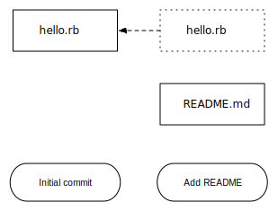
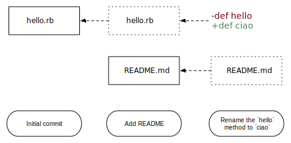
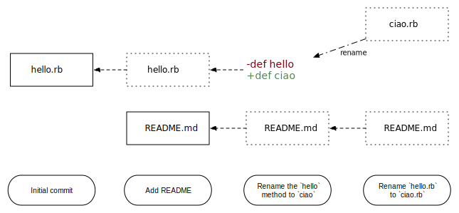

name: cover
class: center, middle


---
name: whoami
class: center, middle

# Andrea Leopardi  
### an.leopardi@gmail.com  
### @whatyouhide
##### Web developer  

???
- Sono anche un maestro delle arti oscure di git.
- Interrompete per qualsiasi domanda, le domande mi gasano


---
class: center, middle

# Cos'è git?

???
# Survey
- quanti conoscono git?
- quanti conoscono svn?


--
Git è un *distributed version control system*

--
#### open source

--
#### veloce

--
#### efficiente (spaziotempo)

--
#### open source!


---
name: installation-cover
class: center, middle

# Installazione


---
name: installation-links
class: left, middle

### Linux

```bash
apt-get install git-core    # *buntu, Debian
yum install git-core        # Fedora
```

### OS X

http://git-scm.com/downloads

### ...Windows?

http://msysgit.github.com/

???
Ovviamente git è molto unix-oriented  
Funziona alla perfezione anche su Windows ma la sua filosofia e' Unix  
Fare una cosa e farla bene (ogni subcommand)


---
# Come funziona git?


---
class: center, middle

Serve a fare istantanee (*snapshot*) di insiemi di file.


???
Git tiene traccia **intelligentemente** solo dei file cambiati e solo dei
cambiamenti.

--
In questo modo si mantiene una storia di tutti i cambiamenti effettuati nel
progetto.


---
class: center, middle, concept-cover

# commit


---
Un commit è uno snapshot della repository.


???
Muovendomi da un commit a un altro posso tornare esattamente allo stato della
repository a un dato commit.


--
Un commit è lo stato della repository in un certo momento.


--
Ha associati:
- autore
- messaggio


---
class: middle, max-width-img, less-padded


---
class: middle, max-width-img, less-padded




---
class: middle, max-width-img, less-padded




---
class: middle, max-width-img, less-padded




---
class: more-padded

In una repository, i file possono trovarsi in tre *stati*:

--
- **unmodified**: il file non è stato modificato dall'ultimo commit
--

- **non staged**: il file è visibile a git ed è stato modificato dall'ultimo
  commit, ma non è ancora *candidato* ad essere committato

--
- **staged**: il file è visibile a git, modificato dall'ultimo commit e i suoi
  cambiamenti verranno registrati nel commit successivo

--
- **untracked**: il file è invisibile a git


---
class: middle

```
ironmac ~/Code/git-talk-ingegneria/repos/file-states → git status
On branch master
Changes to be committed:
  (use "git reset HEAD <file>..." to unstage)

        modified:   hello.rb

Changes not staged for commit:
  (use "git add <file>..." to update what will be committed)
  (use "git checkout -- <file>..." to discard changes in working directory)

        modified:   README.md

Untracked files:
  (use "git add <file>..." to include in what will be committed)

        LICENSE.txt
```


---
class: more-padded

## Come cambio stato?

- I file sono **untracked** quando li aggiungo nella repository
- `git add [filename]` fa diventare `[filename]` staged (sia se era tracked che
  untracked)

???
Andare in `repos/file-states` e fare una demo di `git add` e di `git commit`.
Ricordarsi di non usare `g` e `c`.


---
name: git-init-cover
class: center, middle, git-command-cover

# `git init`


---
class: more-padded

Inizializza una repository git:

```
ironmac ~/Code/git-talk-ingegneria/tmp → git init
Initialized empty Git repository in /Users/ironmac/Code/git-talk-ingegneria/tmp/.git/
```

--
Crea semplicemente una directory `.git` nella directory corrente:

```
ironmac ~/Code/git-talk-ingegneria/tmp → ls -la
total 0
drwxr-xr-x   3 ironmac  staff  102 May 27 18:44 .
drwxr-xr-x  14 ironmac  staff  476 May 27 18:34 ..
drwxr-xr-x   9 ironmac  staff  306 May 27 18:44 .git
```

--
Si può facilmente rimuovere git da una repository:

```
ironmac ~/Code/git-talk-ingegneria/tmp → rm -rf .git
```
