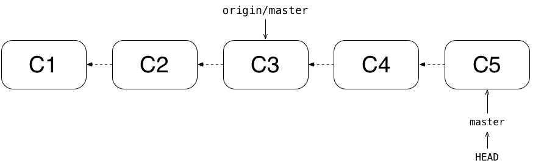
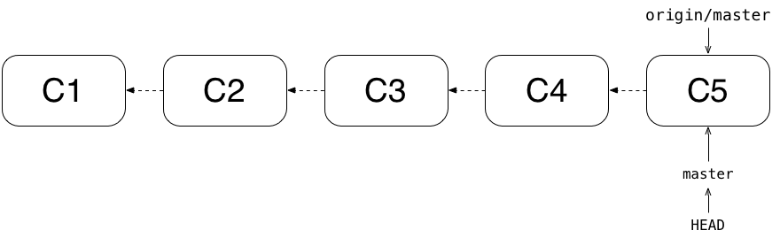

name: cover
class: center, middle

---
# Cos'è git?

???
- **Survey**: quanti conoscono git?

--
Git è un *distributed version control system*

--
#### open source

--
#### veloce

--
#### potente

---
layout: true
# Centralized Version Control Systems (svn)

---
Vantaggi (rispetto a sistemi più primitivi)
- Ogni developer si riferisce alla stessa versione del progetto
- Ogni developer nel progetto ha un'idea del lavoro che stanno facendo gli altri
- Gli amministratori del progetto hanno controllo sulla repository

---
Svantaggi (rispetto a VCS distribuiti)
- Il server dove è hostata la repository è un single point of failure: 
    - **va down** nessun download/upload di codice
    - **necessita backup** altrimenti si potrebbe perdere tutta la storia del
        progetto
- Ogni developer, ogni volta che vorrà partecipare a un progetto, dovrà
    downloadare **tutta** la repository alla versione corrente + modificare +
    uploadare di nuovo

---
layout: true
# Distributed VCS (git, mercurial)

---

Vantaggi
- Ogni client è un mirror della repository
- Clonare una repository clona *tutta* la sua storia
- Ogni client è un "backup" della repository → probabilità ~0 di perdere dati
- Quando si uploada/downloada codice, si muovono solo i cambiamenti

---
Svantaggi

--

<!-- Archittettura di git --------------------------------------------------->

---
layout: false
class: concept-cover, middle, center
# Architettura

---
## Snapshot, non differenze

SVN → lista di cambiamenti applicati ai file.

Git → *snapshot* della repo: fotografie (mini filesystem) della repository in un
certo momento.

---
class: middle, max-width-img

---
class: middle, max-width-img

---
class: middle, max-width-img

---
class: middle, max-width-img

---
## Quasi tutte le operazioni sono locali

Non si ha quasi mai bisogno della rete per svolgere operazioni.

---
## Git ha *integrity*

--
- In git viene fatto un checksum (SHA1) di qualsiasi cosa (in modo da poter
    identificare univocamente quel qualcosa)

--
- È impossibile cambiare il contenuto dei file senza che git se ne accorga

--
.sha1[
b858a87c07b04c4568f51b0dce655f78d73c02b3
]

---
## Git (quasi sempre) aggiunge solo dati

Ci sono poche operazioni (spesso sconsigliate/pericolose) che costringono git a
*cancellare* dati.

In genere qualsiasi operazione (anche di cancellazione) **aggiunge** dati alla
repository.

<!-- Stati dei file ---------------------------------------------------------->

---
class: center, middle, concept-cover
# Stati dei file

---
class: more-padded
In una repository, i file possono trovarsi in tre *stati*:

--
- **unmodified**

--
- **non staged**

--
- **staged**

--
- **untracked**

---
class: more-padded
## Come cambio stato?

- I file sono **untracked** quando li aggiungo nella repository
- `git add [filename]` fa diventare `[filename]` staged (sia se era tracked che
  untracked)

???
Andare in `repos/file-states` e fare una demo di `git add` e di `git commit`.
Ricordarsi di non usare `g` e `c`.

<!-- Commit ------------------------------------------------------------------>

---
class: middle, center, concept-cover
# commit

---
class: center, middle

???
- sha1
- puntatore al parent
- autore <email>
- ptr al tree con le modifiche
- messaggio

---
class: center, middle, concept-cover
# Branching

???
Branchare in git è supersemplice, velocissimo e consigliatissimo.

---
class: center, middle

Un branch è un *puntatore a un commit* che permette di sviluppare più versioni
della stessa repository parallelamente.

---
class: center, middle

---
class: middle, center

???
Di solito il branch principale si chiama `master`.

---
class: center, more-padded

In ogni momento mi trovo in un branch: quello puntato da `HEAD`.

???
`HEAD` è un puntatore a branch che indica a git su quale branch mi trovo.

Committare in un branch significa mettere il commit puntato dal branch corrente
come padre del nuovo commit e spostare il puntatore del branch sul nuovo commit.

---
class: more-padded, center

Ora branchamo per creare, ad esempio, una nuova feature:

---

???
Avanziamo in `post-autosave` facendo due nuovi commit.

---

???
Nel frattempo riceviamo un bug report che ci costringe a fixare un bug urgente.
Torniamo su master, branchamo di nuovo e committiamo una volta nel branch `fix`.

---
class: middle, center

### `post-autosave` e `fix` sono **diverging branches**.

---
class: max-width-img, center

## Merge di `fix` in `master`: fast-forward

???
Siamo soddisfatti del fix nel branch `fix`, ora vogliamo far sì che esso sia
visibile anche in `master`.

**Fast-forward** significa spostare il puntatore del branch
in cui si mergia nel punto dove si trova il puntatore del branch che viene
mergiato.

---
class: less-padded, max-width-img, middle

???
Ora torniamo su `post-autosave` e facciamo un altro commit per finire
la feature.

---
class: max-width-img, more-padded

Torniamo su `master` e mergiamo con `post-autosave`. 

???
Git trova l'antenato comune dei due commit e lo rende padre di un nuovo commit
che rappresenta il merge di branch che sono **diverged**.

---
class: center, middle, concept-cover

# Remotes

---
Versioni di una repository che sono hostate su server remoti.

--
Dal remote si può:

- **clone**
- **pull**
- **push**

???
- **clone**: cloniamo la repository remota in locale (compresa tutta la storia
  della repository)
- **pull**: quando facciamo `git pull` dalla nostra repository locale
  scarichiamo in locale tutti i cambiamenti avvenuti nella repository
  dall'ultima volta che abbiamo pullato
- **push**: uploadiamo i cambiamenti (commit) che abbiamo fatto in locale
  (dall'ultimo push) sul server remoto

---
class: middle, center
# `origin`

???
Di solito il remote principale si chiama `origin`.
I branch remoti vengono prifissati da `origin/`.

---
class: middle, center, max-width-img

---
class: middle, center, max-width-img

# `push`/`pull`

???
Sia pull che push sortiscono un effetto simile, ovvero spostare il puntatore
`origin/master`.
La differenza:
- `pull`: sposta il puntatore locale `origin/master` dove esso si trova
  effettivamente sul remote
- `push`: sposta il puntatore `master` sul remote `origin` dove si trova il
  puntatore `master` locale (e aggiorna `origin/master` in locale ovviamente)

---
class: middle, center

???
GitHub è il più famoso hosting service che usa git come VCS.

È gratuito per progetti **open source**, mentre richiede un abbonamento mensile
per hostare repository private.

È lo standard de facto per l'open source. È un modo fantastico di imparare git e
allo stesso tempo imparare molto da progetti open source.

### Piccola demo di GitHub

- Andare sulla homepage
- `dotfiles`: io su GH ci tengo tutte le configurazioni del mio computer (dove ho
  400+ commits!)
- `git-talk-ingegneria`: tutte le slide di questo seminario sono su GitHub

È diventato talmente lo standard de facto che quando qualcuno dice che non hosta
le sue repo su GitHub facciamo tutti questa faccia...

---
class: middle, center

---
name: bitbucket-logo
class: middle, center

???
BitBucket è molto simile a GitHub ma permette gratuitamente un numero limitato
di repository private: probabilmente userete più spesso questo.

---
class: center, middle, concept-cover

# Hands down

---
class: middle, center, command-cover
`git clone` + `git remote`
`git status`
`git add`
`git commit`
`git commit --amend`
`git push`
`git pull`
`git checkout` + `git branch`
`git merge`
`git stash`
`git log`

???
# Use case
Siamo in `fix` con dei cambiamenti, vogliamo pullare `master`.
- **stashamo** i cambiamenti
- `git checkout master && git pull`
- `git checkout fix`
- `git stash apply`

---
class: middle, center, command-cover

---
class: middle, center, concept-cover
# Advanced concepts

???
Questi concetti sono avanzati, però vale la pena approfondirli.

---
class: more-paddedd
- `git rebase`

--
- Tags

--
- `git reset [--hard|--soft]`

--
- Hooks

???
Use case degli hooks: c'è un hook che permette di eseguire uno script ogni volta
che l'utente fa un commit. Combinato con un programmino che scatta foto con la
webcam, si ottiene un **gitshot**. (continua)

---
name: gitshots
class: center

450 commit - 3 mesi - 25 foto al secondo

<video controls>
    <source src="gitshots.webm"/>
</video>
