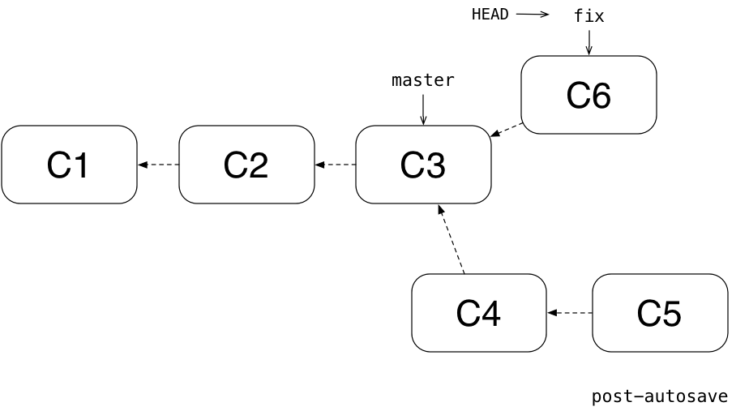
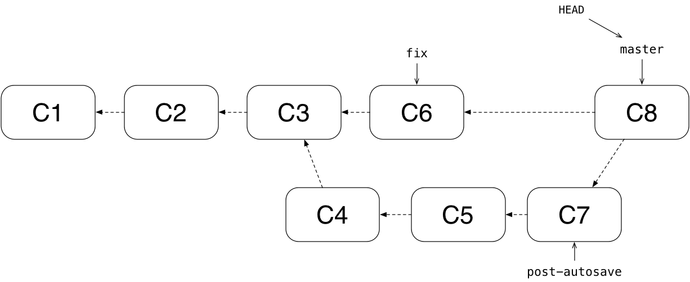

name: cover
class: center, middle


---
class: center, middle

# Cos'è git?

???
# Survey
- quanti conoscono git?
- quanti conoscono svn?


--
Git è un *distributed version control system*

--
#### open source

--
#### veloce

--
#### efficiente (spaziotempo)


---
# Come funziona git?


---
class: center, middle

Serve a fare istantanee (*snapshot*) di insiemi di file.


???
Git tiene traccia **intelligentemente** solo dei file cambiati e solo dei
cambiamenti.

--
In questo modo si mantiene una storia di tutti i cambiamenti effettuati nel
progetto.

--
Il cuore di git sono i *commit*.


---
Un commit è uno snapshot della repository.


???
Muovendomi da un commit a un altro posso tornare esattamente allo stato della
repository a un dato commit.


--
Un commit è lo stato della repository in un certo momento.


--
Ha associati:
- autore
- messaggio


---
class: middle, max-width-img, less-padded


---
class: middle, max-width-img, less-padded


---
class: middle, max-width-img, less-padded


---
class: middle, max-width-img, less-padded


---
class: center, middle, concept-cover

# Stati dei file


---
class: more-padded

In una repository, i file possono trovarsi in tre *stati*:

--
- **unmodified**
???
Il file non è stato modificato dall'ultimo commit

--
- **non staged**
???
Il file è visibile a git ed è stato modificato dall'ultimo
commit, ma non è ancora *candidato* ad essere committato

--
- **staged**
???
Il file è visibile a git, modificato dall'ultimo commit e i suoi
cambiamenti verranno registrati nel commit successivo

--
- **untracked**
???
Il file è invisibile a git


---
<!-- TODO Ce la metto questa slide o lo faccio vedere nella demo? -->
class: middle

```
ironmac ~/Code/git-talk-ingegneria/repos/file-states → git status
On branch master
Changes to be committed:
  (use "git reset HEAD <file>..." to unstage)

        modified:   hello.rb

Changes not staged for commit:
  (use "git add <file>..." to update what will be committed)
  (use "git checkout -- <file>..." to discard changes in working directory)

        modified:   README.md

Untracked files:
  (use "git add <file>..." to include in what will be committed)

        LICENSE.txt
```


---
class: more-padded

## Come cambio stato?

- I file sono **untracked** quando li aggiungo nella repository
- `git add [filename]` fa diventare `[filename]` staged (sia se era tracked che
  untracked)

???
Andare in `repos/file-states` e fare una demo di `git add` e di `git commit`.
Ricordarsi di non usare `g` e `c`.


---
class: middle, center, concept-cover

# commit


---
class: center, more-padded

Identificato univocamente da uno SHA1 dei file presenti nella repository.


???
Spiegare cosa è uno SHA1:
- 40 caratteri
- esadecimali

Git è capace di capire quando cambia qualsiasi cosa grazie a questo SHA1.

--
.sha1-intro[
b858a87c07b04c4568f51b0dce655f78d73c02b3
]


---
class: center, middle


---
class: center, middle, concept-cover
# Branching


---
class: center, middle

Un branch è un *puntatore a un commit* che permette di sviluppare più versioni
della stessa repository parallelamente.


---
class: center, middle


---
class: middle, center


???
Di solito il branch principale si chiama `master`.


---
class: center, more-padded

In ogni momento mi trovo in un branch: quello puntato da `HEAD`.


???
`HEAD` è un puntatore a branch che indica a git su quale branch mi trovo.

Committare in un branch significa mettere il commit puntato dal branch corrente
come padre del nuovo commit e spostare il puntatore del branch sul nuovo commit.


---
class: more-padded, center

Ora branchamo per creare, ad esempio, una nuova feature:


---


???
Avanziamo in `post-autosave` facendo due nuovi commit.


---


???
Nel frattempo riceviamo un bug report che ci costringe a fixare un bug urgente.
Torniamo su master, branchamo di nuovo e committiamo una volta nel branch `fix`.


---
class: middle, center

### `post-autosave` e `fix` sono **diverging branches**.


---
class: max-width-img, center

## Merge di `fix` in `master`: fast-forward


???
Siamo soddisfatti del fix nel branch `fix`, ora vogliamo far sì che esso sia
visibile anche in `master`.

**Fast-forward** significa spostare il puntatore del branch
in cui si mergia nel punto dove si trova il puntatore del branch che viene
mergiato.


---
class: less-padded, max-width-img, middle


???
Ora torniamo su `post-autosave` e facciamo un altro commit per finire
la feature.


---
class: max-width-img, more-padded

Torniamo su `master` e mergiamo con `post-autosave`. 


???
Git trova l'antenato comune dei due commit e lo rende padre di un nuovo commit
che rappresenta il merge di branch che sono **diverged**.


---
<!-- TODO merge conflict -->
