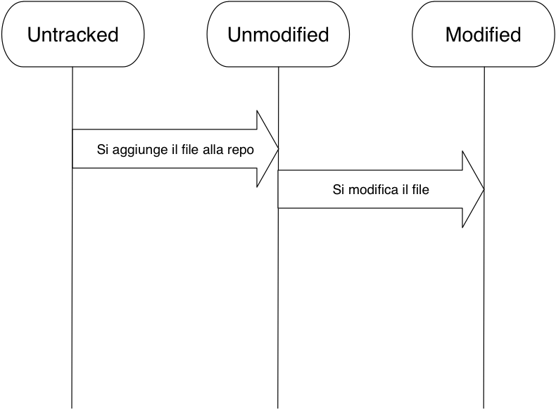

name: cover
class: center, middle


---
name: who-am-i
class: center, middle
# Andrea Leopardi

.email[
mailto:an.leopardi@gmail.com
]
.twitter[
@whatyouhide
]
.github-username[
https://github.com/whatyouhide
]

???
Sono uno studente di Informatica e lavoro come sviluppatore web
(frontend + backend, Rails).

Per favore interrompete per farmi domande.


---
class: center
# Cos'è git?


???
- **Survey**: quanti conoscono git?

--
Git è un *distributed version control system*

--
#### open source

--
#### veloce

--
#### potente


---
class: less-padded-top
layout: true
## Centralized Version Control Systems (svn)

---


---
Vantaggi (rispetto a sistemi più primitivi)

--
- Ogni developer si riferisce alla stessa versione del progetto

--
- Ogni developer nel progetto ha un'idea del lavoro che stanno facendo gli altri

--
- Gli amministratori del progetto hanno controllo sulla repository


---
Svantaggi (rispetto a VCS distribuiti)

--
- Il server è un single point of failure
    * **va down**: nessun download/upload di codice
    * **necessita backup**: rischio di perdere tutta la history del progetto

--
- Ogni developer dovrà sempre downloadare **tutta** la repository alla versione
    corrente + modificare + uploadare di nuovo


---
layout: true
class: less-padded-top
## Distributed VCS (git, mercurial)

---


---
Vantaggi

--
- Ogni client è un *mirror* della repository

--
- Clonare una repository clona *tutta* la sua storia

--
- Ogni client è un "backup" della repository → probabilità ~0 di perdere dati

--
- Quando si uploada/downloada codice, si muovono solo i cambiamenti


---
Svantaggi


--
.centered-image[

]


<!-- Archittettura di git --------------------------------------------------->

---
layout: false
class: concept-cover, middle, center
# Architettura di git


---
## Snapshot, non differenze

--
SVN → lista di cambiamenti applicati ai file.


--
Git → *snapshot* della repo: fotografie (mini filesystem) della repository in un
certo momento.

---
class: middle, max-width-img


---
class: middle, max-width-img


---
class: middle, max-width-img


---
class: middle, max-width-img


---
## Quasi tutte le operazioni sono locali

Non si ha quasi mai bisogno della rete per svolgere operazioni.


---
## Git ha *integrity*

--
- In git viene fatto un checksum (SHA1) di qualsiasi cosa (in modo da poter
    identificare univocamente quel qualcosa)

--
- È impossibile cambiare il contenuto dei file senza che git se ne accorga

--
.sha1[
b858a87c07b04c4568f51b0dce655f78d73c02b3
]


---
## Git (quasi sempre) aggiunge solo dati

--
Ci sono poche operazioni (spesso sconsigliate/pericolose) che costringono git a
*cancellare* dati.


--
In genere qualsiasi operazione (anche di cancellazione) **aggiunge** dati alla
repository.


<!-- Stati dei file ---------------------------------------------------------->

---
class: center, middle, concept-cover
# Lifecycle di un file

---
class: center, max-width-img, less-padded
layout: true
## Lifecycle di un file

---


---


---


---


---


---


<!-- Commit ------------------------------------------------------------------>

---
layout: false
class: middle, center, concept-cover
# Commit


---
class: center, middle


???
- sha1
- puntatore al parent
- autore <email>
- ptr al tree con le modifiche
- messaggio


<!-- Branching --------------------------------------------------------------->

---
class: center, middle, concept-cover
# Branching

???
Branchare in git è supersemplice, velocissimo e consigliatissimo.


---
class: center, middle

Un branch è un *puntatore a un commit* che permette di sviluppare più versioni
della stessa repository parallelamente.


---
class: center, middle


---
class: middle, center
Di solito il branch principale si chiama `master`


---
class: center, more-padded
In ogni momento mi trovo in un branch: quello puntato da `HEAD`


???
Committare in un branch significa mettere il commit puntato dal branch corrente
come padre del nuovo commit e spostare il puntatore del branch sul nuovo commit.


---
class: less-padded-top, center
Ora branchamo per creare, ad esempio, una nuova feature: `post-autosave`


---
class: less-padded-top
Avanziamo in `post-autosave` facendo due nuovi commit


---
class: less-padded-top
*Bug report* per un bug urgente: torniamo su `master`, branchamo e
committiamo una volta nel branch `fix`


???
`post-autosave` e `fix` sono **diverging branches**.


---
class: max-width-img, less-padded-top
## Merge di `fix` in `master`: fast-forward

Abbiamo finito in `fix`, vogliamo rendere disponibile il fix anche in `master`:

.centered-image[

]

???
Ci spostiamo su `master` e mergiamo `fix`

**Fast-forward** significa spostare puntatore del branch → puntatore del branch
che viene mergiato


---
class: max-width-img, middle
Ora torniamo su `post-autosave` e facciamo un altro commit per finire
la feature


---
class: max-width-img, less-padded
Torniamo su `master` e mergiamo con `post-autosave`: git crea un nuovo **merge
commit**.


???
Git trova l'antenato comune dei due commit e lo rende padre di un nuovo commit
che rappresenta il merge di branch che sono **diverged**.


<!-- Remotes ----------------------------------------------------------------->

---
class: middle, center, concept-cover
# Remotes


---
class: middle, center
Di solito il remote principale si chiama `origin`.

I branch remoti vengono prifissati da `origin/`: `origin/master`, `origin/fix`.


---
class: middle, max-width-img, less-padded-top
# `push`/`pull`

- `push`: upload dei cambiamenti in locale su un remote
- `pull`: download dei cambiamenti su un remote in locale

???
Operazione chiave: si muove `origin/{branch}`: se pulliamo quello locale si
aggiorna a quello remoto, se pushamo quello remoto viene aggiornato a quello
locale.


---
class: middle, center


È il più famoso hosting service che usa git come VCS.

???

- gratuito per progetti **open source**
- abbonamento per repository private

È lo standard de facto per l'open source.

### Piccola demo di GitHub (sito)

- Andare sulla homepage
- `dotfiles`: io su GH ci tengo tutte le configurazioni del mio computer (dove
    ho ~500 commits!)
- `git-talk-ingegneria`: tutte le slide di questo seminario sono su GitHub


---
name: bitbucket-logo
class: middle, center


Simile a GitHub ma permette un numero limitato di repo *private*.

???
Utile quando si sviluppano prodotti per un cliente dato che il codice non può
essere reso open source per questioni di vulnerabilità/proprietà.


<!-- Hands down -------------------------------------------------------------->

---
class: center, middle, concept-cover
# Hands down


---
class: less-padded-top
# Installazione:

### Linux
```bash
apt-get install git-core # *buntu, debian
yum install git-core     # fedora
```

### OS X
http://git-scm.com/download/mac

### ...Windows?
http://msysgit.github.io/


---
class: center, middle, concept-cover
# Demo

???
### Roba da scrivere in JS
```javascript
Greeter = (function () {
  'use strict';

  Greeter.prototype.hello = function (name) {
    return ['Hello', name].join(' ');
  };
})();
```

### Use case di `stash`
Siamo in `fix` con dei cambiamenti, vogliamo pullare `master`.
- **stashamo** i cambiamenti
- `git checkout master && git pull`
- `git checkout fix`
- `git stash apply`


<!-- Conclusion -------------------------------------------------------------->

---
class: middle, center, concept-cover
# Advanced concepts

???
Questi concetti sono avanzati, però vale la pena approfondirli.


---
class: more-padded, center
`git rebase`


--
`git reset [--hard|--soft]`


--
Tags


--
Hooks


???
Use case degli hooks: c'è un hook che permette di eseguire uno script ogni volta
che l'utente fa un commit. Combinato con un programmino che scatta foto con la
webcam, si ottiene un **gitshot**. (continua)


---
class: middle, center
name: questions

?

???
Domande?


---
class: max-width-img, center, middle
## Grazie!


